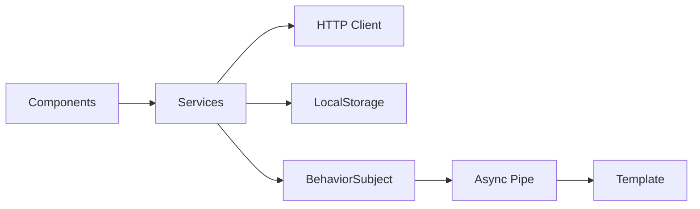
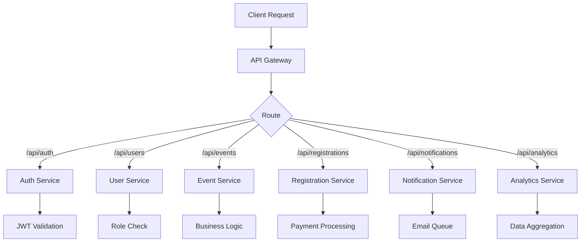
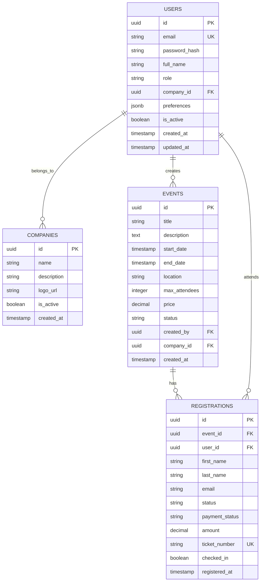
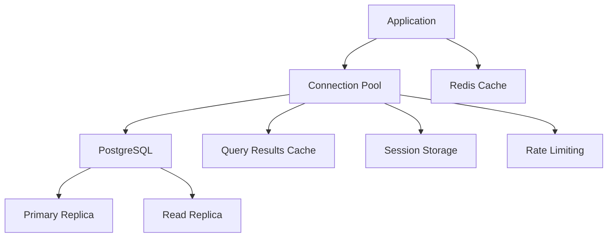
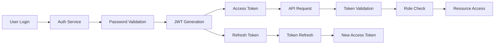
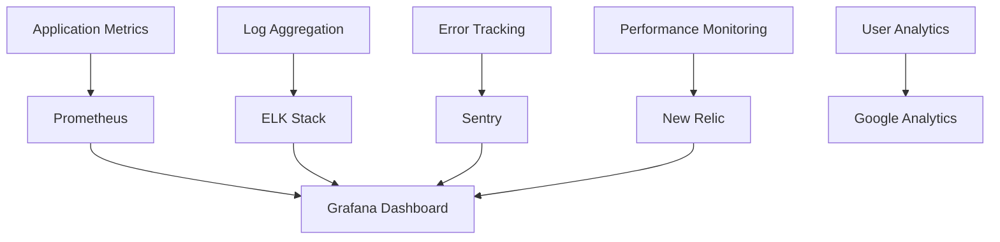
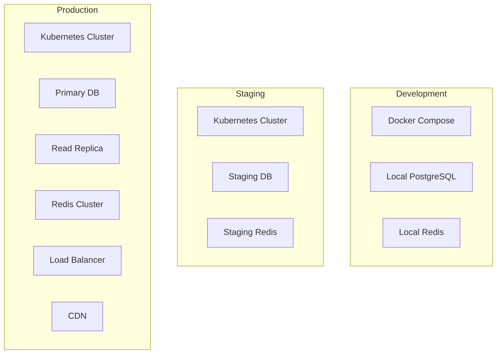
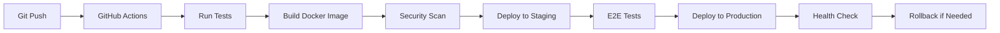
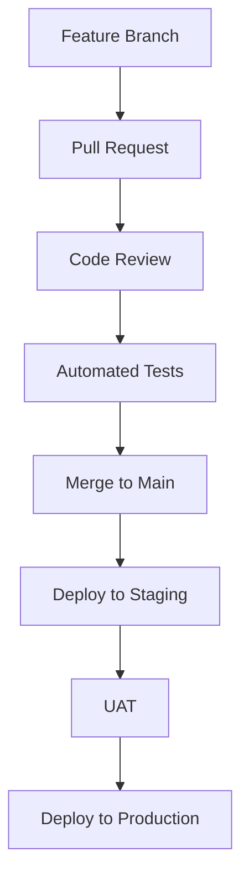

# EventHub - Complete Project Architecture Diagram
# =============================================

## 🏗️ System Architecture Overview



```mermaid
graph TB
    subgraph "Frontend Layer"
        A[Angular 17.3 Application]
        A1[Components]
        A2[Services]
        A3[Guards]
        A4[Interceptors]
        A5[Routing]
    end
    
    subgraph "API Gateway Layer"
        B[Express.js API Gateway]
        B1[Authentication]
        B2[Rate Limiting]
        B3[CORS]
        B4[Security Headers]
    end
    
    subgraph "Backend Services"
        C[Node.js Microservices]
        C1[Auth Service]
        C2[User Service]
        C3[Event Service]
        C4[Registration Service]
        C5[Notification Service]
        C6[Analytics Service]
        C7[File Upload Service]
    end
    
    subgraph "Data Layer"
        D[PostgreSQL Database]
        D1[Users Table]
        D2[Events Table]
        D3[Registrations Table]
        D4[Companies Table]
        D5[Audit Logs]
        
        E[Redis Cache]
        E1[Session Storage]
        E2[API Response Cache]
        
        F[File Storage]
        F1[User Avatars]
        F2[Event Images]
        F3[Documents]
    end
    
    subgraph "External Services"
        G[Email Service]
        G1[Nodemailer]
        
        H[Payment Gateway]
        H1[Stripe]
        H2[PayPal]
        
        I[Cloud Storage]
        I1[AWS S3]
        
        J[Analytics]
        J1[Google Analytics]
    end
    
    A --> B
    B --> C
    C --> D
    C --> E
    C --> F
    C --> G
    C --> H
    C --> I
    C --> J
```

## 🎯 Frontend Architecture (Angular 17.3)

### Component Structure
```
src/app/
├── components/
│   ├── auth/
│   │   ├── login/
│   │   ├── register/
│   │   └── forgot-password/
│   ├── admin/
│   │   ├── dashboard/
│   │   ├── events/
│   │   ├── users/
│   │   ├── registrations/
│   │   └── analytics/
│   ├── public/
│   │   ├── home/
│   │   ├── events/
│   │   ├── about/
│   │   └── contact/
│   └── shared/
│       ├── header/
│       ├── footer/
│       ├── sidebar/
│       └── loading/
├── services/
│   ├── auth.service.ts
│   ├── user.service.ts
│   ├── event.service.ts
│   ├── registration.service.ts
│   └── notification.service.ts
├── guards/
│   ├── auth.guard.ts
│   ├── admin.guard.ts
│   └── manager.guard.ts
├── interceptors/
│   ├── auth.interceptor.ts
│   └── error.interceptor.ts
├── models/
│   ├── user.model.ts
│   ├── event.model.ts
│   └── registration.model.ts
└── utils/
    ├── constants.ts
    ├── helpers.ts
    └── validators.ts
```

### State Management


## 🔧 Backend Architecture (Node.js + Express)

### Microservices Structure
```
backend/
├── api-gateway/
│   ├── server.js
│   ├── middleware/
│   │   ├── auth.js
│   │   ├── rateLimit.js
│   │   └── cors.js
│   └── routes/
├── services/
│   ├── auth-service/
│   │   ├── controllers/
│   │   ├── models/
│   │   ├── routes/
│   │   └── utils/
│   ├── user-service/
│   ├── event-service/
│   ├── registration-service/
│   ├── notification-service/
│   └── analytics-service/
├── shared/
│   ├── database/
│   ├── middleware/
│   ├── utils/
│   └── config/
└── tests/
    ├── unit/
    ├── integration/
    └── e2e/
```

### API Endpoints Structure


## 🗄️ Database Architecture (PostgreSQL)

### Schema Design


### Database Optimization


## 🔐 Security Architecture

### Authentication & Authorization


### Security Layers
```
1. Network Security
   - HTTPS/TLS 1.3
   - WAF (Web Application Firewall)
   - DDoS Protection
   - Rate Limiting

2. Application Security
   - JWT Authentication
   - Role-Based Access Control (RBAC)
   - Input Validation & Sanitization
   - SQL Injection Prevention
   - XSS Protection
   - CSRF Protection

3. Data Security
   - Encryption at Rest (AES-256)
   - Encryption in Transit (TLS)
   - Hashed Passwords (bcrypt)
   - PII Data Masking
   - Audit Logging

4. Infrastructure Security
   - Environment Variables
   - Secret Management
   - Container Security
   - Network Segmentation
   - Regular Security Updates
```

## 📊 Analytics & Monitoring

### Monitoring Stack


### Key Metrics Tracked
```
1. Business Metrics
   - User Registration Rate
   - Event Creation Rate
   - Registration Conversion Rate
   - Revenue per Event
   - User Engagement

2. Technical Metrics
   - API Response Time
   - Database Query Performance
   - Cache Hit Rate
   - Error Rate
   - Server Uptime

3. Security Metrics
   - Failed Login Attempts
   - Suspicious Activities
   - API Abuse Detection
   - Data Access Logs
```

## 🚀 Deployment Architecture

### Container Strategy


### CI/CD Pipeline


## 📱 Scalability Architecture

### Horizontal Scaling
```
1. Frontend Scaling
   - Static Asset CDN
   - Load Balancer
   - Multiple App Instances
   - Auto-scaling Groups

2. Backend Scaling
   - Microservices Architecture
   - Database Read Replicas
   - Connection Pooling
   - Caching Layer

3. Storage Scaling
   - Distributed File Storage
   - Image Optimization
   - CDN Distribution
   - Backup Strategy
```

### Performance Optimization
```
1. Database Optimization
   - Indexing Strategy
   - Query Optimization
   - Connection Pooling
   - Caching Layer

2. API Optimization
   - Response Compression
   - Pagination
   - Field Selection
   - Batch Operations

3. Frontend Optimization
   - Lazy Loading
   - Code Splitting
   - Image Optimization
   - Service Workers
```

## 🔧 Development Workflow

### Git Workflow


### Testing Strategy
```
1. Unit Testing
   - Jest for Services
   - Component Testing
   - Mock Dependencies
   - Coverage Reports

2. Integration Testing
   - API Endpoint Testing
   - Database Integration
   - Service Communication
   - Error Scenarios

3. E2E Testing
   - Cypress for User Flows
   - Cross-browser Testing
   - Mobile Testing
   - Performance Testing
```

## 📋 Technology Stack Summary

### Frontend Stack
```typescript
// Angular 17.3 with SSR
{
  framework: "Angular 17.3",
  language: "TypeScript 5.4",
  styling: "Tailwind CSS 3.4",
  stateManagement: "RxJS + BehaviorSubject",
  http: "Angular HttpClient",
  testing: "Jest + Cypress",
  build: "Angular CLI + Webpack"
}
```

### Backend Stack
```javascript
// Node.js Microservices
{
  runtime: "Node.js 20+",
  framework: "Express.js 4.18",
  database: "PostgreSQL 15+",
  cache: "Redis 7+",
  authentication: "JWT + bcrypt",
  validation: "Joi",
  testing: "Jest + Supertest",
  documentation: "Swagger/OpenAPI"
}
```

### Infrastructure Stack
```yaml
# Cloud Infrastructure
provider: "AWS/Azure/GCP"
containers: "Docker + Kubernetes"
database: "PostgreSQL with Replication"
cache: "Redis Cluster"
storage: "S3/Blob Storage"
cdn: "CloudFront/Azure CDN"
monitoring: "Prometheus + Grafana"
logging: "ELK Stack"
security: "WAF + SSL/TLS"
```

## 🎯 Key Features Implemented

### ✅ Completed Features
1. **Authentication System**
   - JWT-based authentication
   - Role-based access control
   - Password reset functionality
   - Email verification
   - Session management

2. **User Management**
   - CRUD operations
   - Profile management
   - Avatar upload
   - Preferences system
   - Activity logging

3. **Event Management**
   - Full CRUD with validation
   - Category system
   - Status management
   - Bulk operations
   - Search and filtering

4. **Registration System**
   - Registration workflow
   - Payment processing
   - QR code generation
   - Check-in system
   - Waitlist management

5. **Admin Dashboard**
   - Real-time statistics
   - Interactive charts
   - Quick actions
   - Activity monitoring
   - Role-based UI

6. **Security Features**
   - Input validation
   - SQL injection prevention
   - XSS protection
   - CSRF protection
   - Rate limiting

### 🔄 Next Phase Features
1. **Advanced Analytics**
   - Custom reports
   - Data visualization
   - Export functionality
   - Predictive analytics

2. **Communication System**
   - In-app messaging
   - Email templates
   - SMS notifications
   - Push notifications

3. **Integration Features**
   - Calendar sync
   - Payment gateways
   - Third-party APIs
   - Webhook system

## 📈 Performance Targets

### Response Time Targets
```
- API Response: < 200ms (95th percentile)
- Page Load: < 2s (first paint)
- Database Query: < 100ms (average)
- Cache Hit Rate: > 90%
- Uptime: 99.9%
```

### Scalability Targets
```
- Concurrent Users: 10,000+
- Events per Day: 1,000+
- Registrations per Minute: 100+
- File Uploads: 50MB/s
- Database Connections: 1,000+
```

This architecture provides a solid foundation for a scalable, secure, and maintainable event registration system that can grow with business needs while maintaining high performance and security standards.
